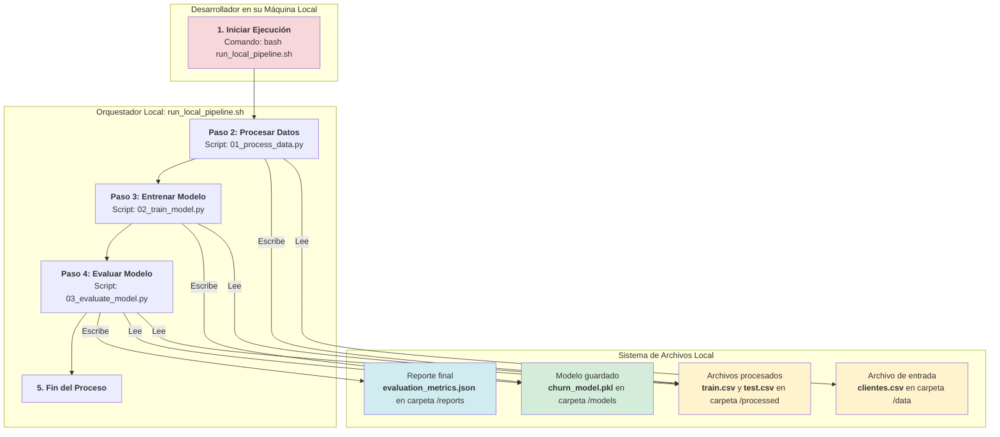
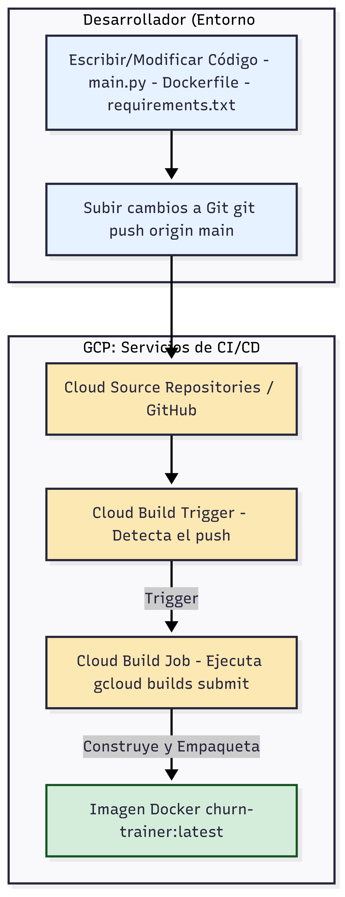
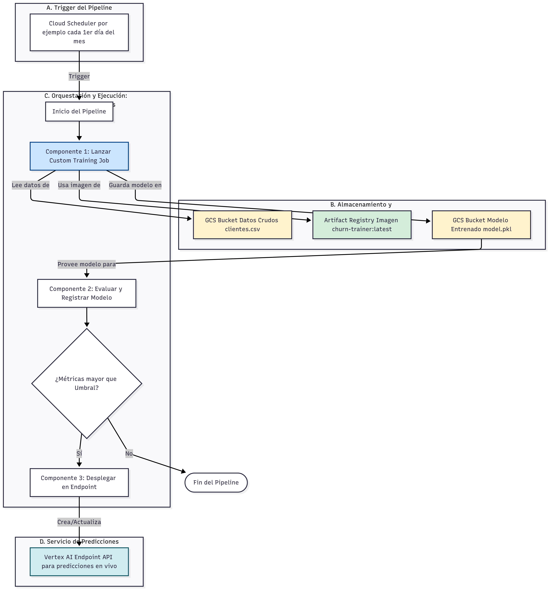

# Pipeline de Predicción de Churn

## Descripción

Este proyecto implementa un pipeline de machine learning para predecir la probabilidad de churn (abandono) de clientes. El modelo utiliza XGBoost y puede ejecutarse tanto en entorno local como en Google Cloud Platform utilizando Vertex AI.

## Características del pipeline.py

- Ingesta de datos desde Google Cloud Storage
- Limpieza y preprocesamiento de datos
- Feature engineering para mejorar la predicción de churn
- Entrenamiento de modelo XGBoost con optimización de hiperparámetros
- Evaluación del modelo usando ROC AUC
- Almacenamiento del modelo entrenado en Google Cloud Storage
- Integración con Vertex AI para entrenamiento y despliegue en la nube

## Requisitos

- Python 3.11+
- Google Cloud SDK
- Acceso a Google Cloud Storage
- Dependencias listadas en `requirements.txt`

## Instalación

```bash
# Clonar el repositorio
git clone <url-del-repositorio>
cd 01_pipeline_ml

# Instalar dependencias
pip install -r requirements.txt

# Configurar autenticación de Google Cloud
gcloud auth application-default login
```

## Uso

### Ejecución Local

```bash
python pipeline.py --gcs-data-path gs://bucket-name/clientes.csv --gcs-model-output-dir gs://bucket-name/models
```

### Ejecución en Vertex AI

```bash
# Crear un job de entrenamiento personalizado en Vertex AI
gcloud ai custom-jobs create \
  --region=us-central1 \
  --display-name=churn-prediction-job \
  --python-package-uris=gs://bucket-name/package/churn_prediction-0.1.tar.gz \
  --python-module=pipeline \
  --container-uri=gcr.io/cloud-aiplatform/training/scikit-learn-cpu.0-23:latest \
  -- \
  --gcs-data-path=gs://bucket-name/clientes.csv \
  --gcs-model-output-dir=gs://bucket-name/models
```

## Estructura del Proyecto

```
01_pipeline_ml/
├── pipeline.py            # Script principal del pipeline de ML
├── requirements.txt       # Dependencias del proyecto
├── churn_model_v2.pkl     # Modelo entrenado (versión local)
├── experimentacion_v2.ipynb  # Notebook de experimentación
├── LICENSE                # Licencia GNU GPL v3.0
└── README.md              # Este archivo
```

## Diagramas

### Diagrama de Entorno Local

Para incluir el diagrama de entorno local, inserta la siguiente imagen:



### Diagrama de Entorno con Vertex AI

Proceso de cambios en el repositorio.



Proceso de entrenamiento y despliegue del modelo en Vertex AI automatizado.



## Contribución

Para contribuir a este proyecto:

1. Haz un fork del repositorio
2. Crea una rama para tu característica (`git checkout -b feature/nueva-caracteristica`)
3. Haz commit de tus cambios (`git commit -am 'Añadir nueva característica'`)
4. Haz push a la rama (`git push origin feature/nueva-caracteristica`)
5. Crea un nuevo Pull Request

## Licencia

Este proyecto está licenciado bajo la Licencia GNU General Public License v3.0 - ver el archivo [LICENSE](LICENSE) para más detalles.