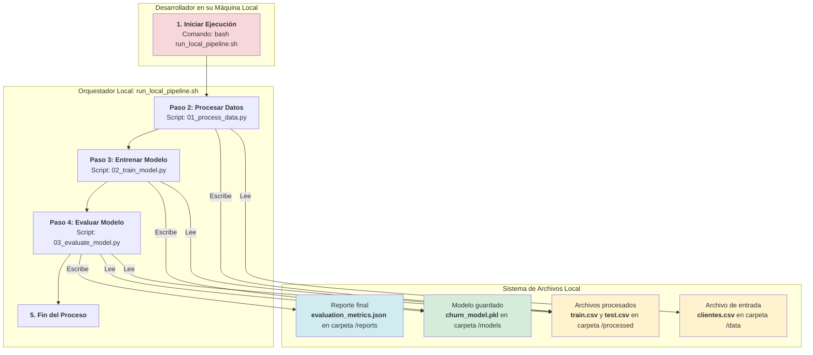
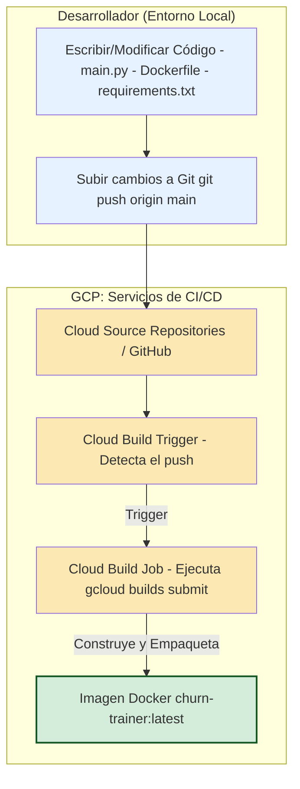
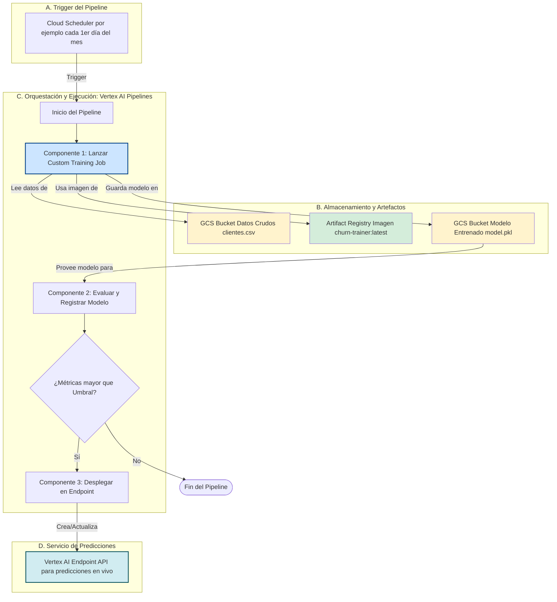

# Pipeline de Predicción de Churn

## Descripción

Este proyecto implementa un pipeline de machine learning para predecir la probabilidad de churn (abandono) de clientes. El modelo utiliza XGBoost y puede ejecutarse tanto en entorno local como en Google Cloud Platform utilizando Vertex AI.

## Características del pipeline.py

- Ingesta de datos desde Google Cloud Storage
- Limpieza y preprocesamiento de datos
- Feature engineering para mejorar la predicción de churn
- Entrenamiento de modelo XGBoost con optimización de hiperparámetros
- Evaluación del modelo usando ROC AUC
- Almacenamiento del modelo entrenado en Google Cloud Storage
- Integración con Vertex AI para entrenamiento y despliegue en la nube

## Requisitos

- Python 3.11+
- Google Cloud SDK
- Acceso a Google Cloud Storage
- Dependencias listadas en `requirements.txt`

## Instalación

```bash
# Clonar el repositorio
git clone <url-del-repositorio>
cd 01_pipeline_ml

# Instalar dependencias
pip install -r requirements.txt

# Configurar autenticación de Google Cloud
gcloud auth application-default login
```

## Uso

### Ejecución Local

```bash
python pipeline.py --gcs-data-path gs://bucket-name/clientes.csv --gcs-model-output-dir gs://bucket-name/models
```

### Ejecución en Vertex AI

```bash
# Crear un job de entrenamiento personalizado en Vertex AI
gcloud ai custom-jobs create \
  --region=us-central1 \
  --display-name=churn-prediction-job \
  --python-package-uris=gs://bucket-name/package/churn_prediction-0.1.tar.gz \
  --python-module=pipeline \
  --container-uri=gcr.io/cloud-aiplatform/training/scikit-learn-cpu.0-23:latest \
  -- \
  --gcs-data-path=gs://bucket-name/clientes.csv \
  --gcs-model-output-dir=gs://bucket-name/models
```

## Estructura del Proyecto

```
01_pipeline_ml/
├── pipeline.py            # Script principal del pipeline de ML
├── requirements.txt       # Dependencias del proyecto
├── churn_model_v2.pkl     # Modelo entrenado (versión local)
├── experimentacion_v2.ipynb  # Notebook de experimentación
├── LICENSE                # Licencia GNU GPL v3.0
└── README.md              # Este archivo
```

## Diagramas

### Diagrama de Entorno Local

Diagrama de flujo de datos y ejecución del pipeline en entorno local.



### Diagrama de Entorno con Vertex AI

Proceso de cambios en el repositorio.



Proceso de entrenamiento y despliegue del modelo en Vertex AI automatizado.



## Cómo Ejecutarlo en Vertex AI

Para correr este script, necesitas empaquetarlo en un contenedor Docker, subirlo a Artifact Registry de GCP y luego lanzar un CustomJob de Vertex AI.

### Paso 1: Organiza tus archivos

Crea una carpeta para tu proyecto con la siguiente estructura:

```
gcp_churn_trainer/
├── main.py             # El script que modificamos arriba
├── requirements.txt    # Las dependencias de Python
└── Dockerfile          # Las instrucciones para construir el contenedor
```

### Paso 2: Usa el archivo requirements.txt

```
pandas
scikit-learn
xgboost
joblib
google-cloud-storage
gcsfs
```

gcsfs es importante para que pandas pueda leer directamente de gs://.

### Paso 3: Crea el Dockerfile

Este archivo le dice a Docker cómo construir la imagen que correrá en Vertex AI.

```dockerfile
# Usar una imagen base de Python
FROM python:3.9-slim

# Establecer el directorio de trabajo
WORKDIR /app

# Copiar el archivo de requerimientos e instalar las dependencias
COPY requirements.txt .
RUN pip install --no-cache-dir -r requirements.txt

# Copiar el script principal al contenedor
COPY pipeline.py .

# Definir el punto de entrada para ejecutar el script
ENTRYPOINT ["python", "pipeline.py"]
```

### Paso 4: Sube tus datos a GCS

Asegúrate de que tu archivo clientes.csv esté en un bucket de Google Cloud Storage. Por ejemplo: gs://mi-bucket-churn/data/clientes.csv.

### Paso 5: Construye y Sube la Imagen Docker a Artifact Registry

Abre una terminal de Cloud Shell o una terminal local con gcloud configurado.

```bash
# Variables (¡reemplaza con tus valores!)
export PROJECT_ID="tu-proyecto-gcp"
export REGION="us-central1" # o tu región preferida
export REPO_NAME="churn-repo"
export IMAGE_NAME="churn-trainer"
export IMAGE_TAG="latest"
export IMAGE_URI="${REGION}-docker.pkg.dev/${PROJECT_ID}/${REPO_NAME}/${IMAGE_NAME}:${IMAGE_TAG}"

# 1. Configurar gcloud
gcloud config set project ${PROJECT_ID}
gcloud config set run/region ${REGION}

# 2. Crear un repositorio en Artifact Registry (solo la primera vez)
gcloud artifacts repositories create ${REPO_NAME} \
    --repository-format=docker \
    --location=${REGION} \
    --description="Repositorio para modelos de churn"

# 3. Construir la imagen con Cloud Build y subirla al repositorio
gcloud builds submit --tag ${IMAGE_URI} .
```

### Paso 6: Lanza el Trabajo de Entrenamiento en Vertex AI

Finalmente, lanza el CustomJob. Este comando le dice a Vertex AI que use tu contenedor y le pasa las rutas de GCS como argumentos.

```bash
# Variables del Job (¡reemplaza con tus valores!)
export BUCKET_NAME="mi-bucket-churn" # El bucket que creaste
export JOB_NAME="churn_training_job_$(date +%Y%m%d_%H%M%S)"
export DATA_PATH="gs://${BUCKET_NAME}/data/clientes.csv"
export MODEL_OUTPUT_DIR="gs://${BUCKET_NAME}/models/"

# Comando para lanzar el CustomJob en Vertex AI
gcloud ai custom-jobs create \
  --region=${REGION} \
  --display-name=${JOB_NAME} \
  --worker-pool-spec=machine-type=n1-standard-4,replica-count=1,container-image-uri=${IMAGE_URI} \
  --args="--gcs-data-path=${DATA_PATH}","--gcs-model-output-dir=${MODEL_OUTPUT_DIR}"
```

## Contribución

Para contribuir a este proyecto:

1. Haz un fork del repositorio
2. Crea una rama para tu característica (`git checkout -b feature/nueva-caracteristica`)
3. Haz commit de tus cambios (`git commit -am 'Añadir nueva característica'`)
4. Haz push a la rama (`git push origin feature/nueva-caracteristica`)
5. Crea un nuevo Pull Request

## Licencia

Este proyecto está licenciado bajo la Licencia GNU General Public License v3.0 - ver el archivo [LICENSE](LICENSE) para más detalles.