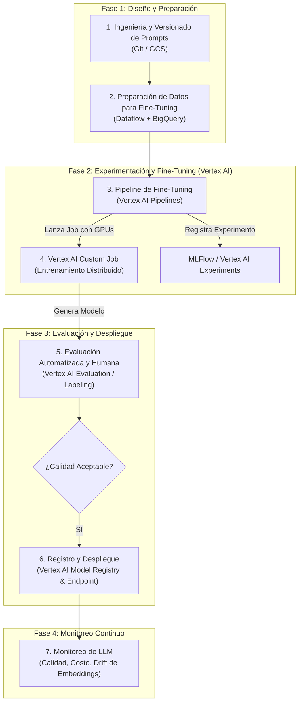

# Integración de LLMOps en una ML Factory sobre GCP

## 1. ¿Qué es LLMOps y por qué es Relevante?

LLMOps (Large Language Model Operations) es la evolución natural de MLOps, adaptada específicamente para el ciclo de vida único de los Modelos de Lenguaje Grandes. Mientras que MLOps tradicional se enfoca en modelos predictivos (como nuestro predictor de abandono), LLMOps aborda desafíos distintos y más complejos. Su relevancia es máxima, ya que permite a las organizaciones pasar de la experimentación con LLMs a la creación de aplicaciones de IA generativa robustas, fiables y escalables.

Las diferencias con MLOps tradicional son:

- **Gestión de Prompts**: Los prompts se convierten en un tipo de "código fuente" que requiere versionado, pruebas y optimización.

- **Fine-Tuning a Escala**: El reentrenamiento de un LLM (fine-tuning) es computacionalmente intensivo y requiere hardware especializado (GPUs/TPUs).

- **Evaluación Compleja**: Métricas como accuracy o F1-score no son suficientes. La evaluación de LLMs se basa en benchmarks (ej. MMLU), métricas de texto (ROUGE, BLEU) y en la retroalimentación humana (RLHF).

- **Monitoreo Específico**: Se debe monitorear el costo por token, la toxicidad, el sesgo, la relevancia de las respuestas y la posible "alucinación" del modelo.

## 2. Adaptando la ML Factory en GCP para LLMOps

Nuestra "ML Factory" actual, diseñada para desplegar recursos como Buckets GCS y Datasets de BigQuery a través de Terraform, y para orquestar pipelines en Vertex AI, es la base perfecta. La integración de LLMOps consiste en especializar cada etapa de esta fábrica.

## 3. Aplicabilidad en el Contexto de la ML Factory

La integración se materializa modificando los componentes de nuestro pipeline de la siguiente manera:

### Ingesta y Preprocesamiento de Datos

- **Antes**: Scripts para procesar clientes.csv.
- **Ahora (LLMOps)**: El pipeline debe incluir componentes de Cloud Dataflow para procesar grandes volúmenes de texto no estructurado (documentos, conversaciones). Los datos de instrucción curados para el fine-tuning se almacenan y versionan en BigQuery o GCS.

### Feature Engineering y Preparación

- **Antes**: Creación de características como `days_since_last_purchase`.
- **Ahora (LLMOps)**: La etapa se transforma en Ingeniería de Prompts. Los prompts se guardan en un repositorio Git y se versionan. El pipeline de CI/CD los empaqueta para que el modelo pueda usarlos.

### Entrenamiento y Validación del Modelo

- **Antes**: Un job de Vertex AI entrenando un modelo XGBoost.
- **Ahora (LLMOps)**: El pipeline de Vertex AI Pipelines orquesta un Custom Training Job que utiliza GPUs (ej. A100) para el fine-tuning. Se utilizan técnicas como LoRA para optimizar el proceso. Vertex AI Experiments o MLFlow se usan para rastrear qué combinación de prompts, datos de fine-tuning y hiperparámetros produce el mejor resultado.

### Despliegue y Monitoreo

- **Antes**: Despliegue en un endpoint de Vertex AI y monitoreo de métricas como ROC AUC.
- **Ahora (LLMOps)**: El modelo fine-tuned se despliega en un Vertex AI Endpoint. El monitoreo es más sofisticado:
  - Vertex AI Model Monitoring se usa para detectar la deriva en los embeddings de entrada.
  - Se implementa logging a BigQuery para capturar prompts y respuestas, permitiendo un análisis de calidad y costos.
  - Se configuran alertas en Cloud Monitoring para métricas como el costo por cada 1000 predicciones, la tasa de respuestas marcadas como "no seguras" o la latencia.
  - La estrategia de Test A/B nos sirve para comparar un nuevo prompt o un modelo re-entrenado contra la versión en producción, usando la división de tráfico de Vertex AI.
  - Un rollback se activa si el nuevo modelo genera respuestas de baja calidad o eleva los costos inesperadamente.

## Finalmente

Integrar LLMOps en una ML Factory sobre GCP es una evolución que especializa cada etapa del pipeline. Se aprovecha la misma base de automatización y orquestación (Terraform, Vertex AI Pipelines), pero se adaptan las herramientas y procesos para manejar los desafíos únicos que presentan los modelos de lenguaje a gran escala, asegurando así su despliegue exitoso y sostenible en producción.

## Licencia

Este proyecto está licenciado bajo la Licencia MIT - ver el archivo [LICENSE](LICENSE) para más detalles.
